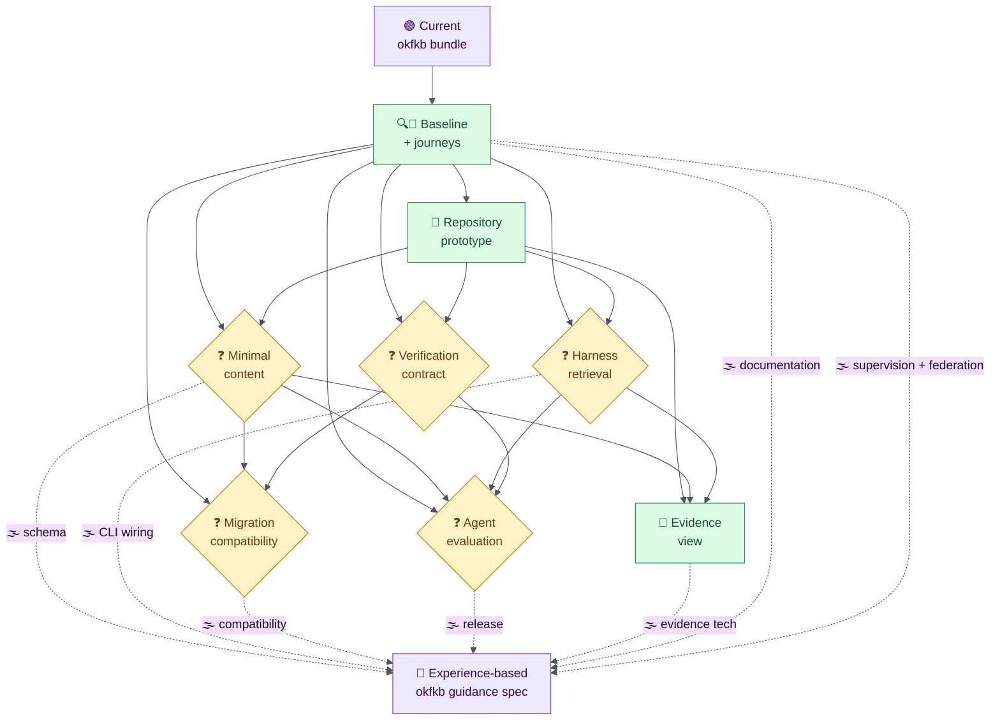

## Destination

An implementation-ready specification for refocusing `okfkb` in place into a simple,
human-governed, experience-based knowledge system for ordinary software repositories, built
from scoped Markdown guidance, evidenced experience records, agent workflows, and verification
tools. The specification should also leave a safe, evidence-preserving path for knowledge
transfer between related knowledge bases without assuming that domains or vocabularies match.

## Notes

- Tracker: local Markdown under `.github/changes/map/refocus-okfkb-experience-guidance/map.md`; ticket paths are identities and
  `blocked_by` is the dependency mechanism.
- This map is planning-only: resolve decisions and produce a clear route, not production code.
- Read `AGENTS.md` and preserve unrelated work. Later implementation must pass `just preflight`.
- Consult the current `okfkb` implementation, skills, docs, archived changes, skill evaluations,
  and the populated `copilot-session-usage/knowledge/` bundle when relevant.
- Use `grill-me` for HITL decision tickets. Keep prototypes disposable and link them as assets.
- Ground behavior claims in paired agent evaluations where applicable.
- Product guardrails: two user-visible kinds (immutable experiences and approved guidance),
  human approval for guidance changes, deterministic checks as authoritative, optional advisory
  semantic review, and no requirement for users to learn OKF vocabulary.
- Gardening has an explicit supervision boundary: an unattended or scheduled run may perform
  safe consolidation and mechanical lifecycle maintenance, but it must not distill Findings into
  hard facts or maintained guidance. Distillation is available only when a human drives the
  gardening session and can supervise the resulting proposals and changes.
- Every eventual hard fact must identify a subdivision of its knowledge base as its scope and a
  human owner. The terms, identity rules, ownership lifecycle, and relationship to Findings and
  approved guidance remain discovery questions rather than settled schema.
- Related knowledge bases may eventually exchange only evidence-preserving, reviewable
  knowledge: bottom-up generalisation, top-down transfer, and horizontal sharing are all
  candidates, but domain compatibility, vocabulary translation, provenance, receiving ownership,
  and conflict handling must be made explicit.

## Map of tickets

This graph shows the primary route, its blocking dependencies, and the unresolved fog. Secondary
exploration tickets are linked below rather than added as nodes so the diagram stays within
Mermaid's 10-node readability limit; the baseline and journey tickets share one foundation node.

## Decisions so far

<!-- One linked line per closed route ticket. Keep detail on the ticket. -->

## Working constraints surfaced

These constraints came from the journey interview and guide later research; they are not yet
implementation decisions:

- Human presence is the distinction between safe maintenance and supervised distillation. A
  scheduler may consolidate what is mechanically safe, but may not turn Findings into hard facts
  or maintained guidance.
- A hard fact is never scope-free or owner-free. Its subdivision scope and accountable human owner
  must remain visible and verifiable.
- Knowledge transfer is not an unconditional copy operation. Generalisation from a lower-level
  repository KB, adoption from a higher-level KB, and sharing between peer KBs need explicit
  eligibility, review, provenance, and vocabulary/domain compatibility checks.

## Secondary exploration threads

The primary diagram stays within its ten-node readability limit. These linked tickets are
deliberately secondary: they organize future analysis and disposable experiments without blocking
the current single-repository route until their contracts are understood.

- [Define the gardening supervision and distillation boundary](tickets/decide-gardening-supervision-boundary.md)
- [Define scoped hard facts and human ownership](tickets/decide-scoped-fact-ownership-contract.md)
- [Research federated knowledge-transfer semantics](tickets/research-federated-knowledge-transfer.md)
- [Prototype cross-knowledge-base transfer journeys](tickets/prototype-federated-transfer-journeys.md)

## Not yet specified

- Exact CLI command names and command grouping after the journeys and prototype reveal the
  natural operations.
- Final schema and configuration syntax after the content, harness, and verification contracts
  converge.
- Deprecation timeline and compatibility window after selective migration behavior is decided.
- Release and version sequence after implementation slices become visible.
- Documentation information architecture after the final user-facing concepts settle.
- Evidence-view implementation technology after its interaction contract is decided.
- What counts as a hard fact, how it differs from an immutable Finding or approved guidance, and
  which lifecycle transitions it may have.
- How a run proves that a human is driving gardening, especially when a scheduler, wrapper, or
  agent starts the process.
- How KB subdivisions form a scope hierarchy, how human owners are identified and replaced, and
  whether ownership is local to one KB or transferable.
- Which claims are generalisable enough to move upward, which higher-level claims are safe to move
  downward, and which peer claims may move horizontally.
- How domain mismatch and restricted vocabulary differences are represented, reviewed, translated,
  rejected, or preserved as an unresolved mapping.
- How receiving KBs approve transferred knowledge without losing source provenance or implying
  universal truth.

## Out of scope

- Hosted RAG, vector databases, or external retrieval infrastructure.
- General project documentation, ADR, reference, task, roadmap, or outcome management.
- Autonomous agent approval of maintained guidance.
- Silent distillation by scheduled or unattended gardening.
- Silent copying or propagation of knowledge between KBs.
- A hosted multi-user collaboration and permissions platform.
- Certification that retained claims are universally true.
