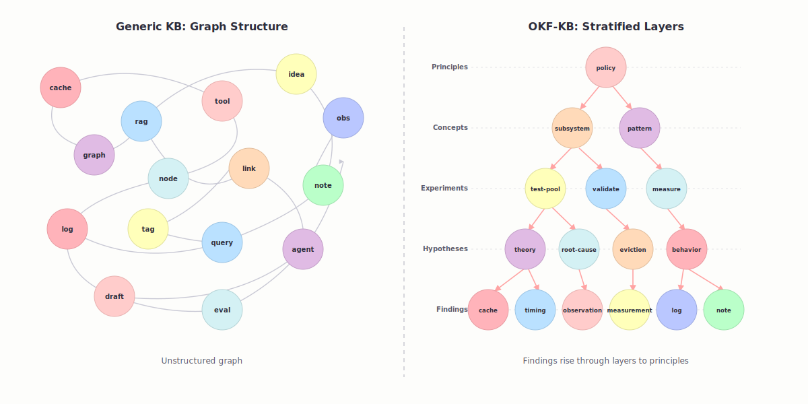

# okf-schema

[](https://github.com/gsemet/okf-schema/actions/workflows/ci.yml)
[](https://codecov.io/gh/gsemet/okf-schema)
[](https://pypi.org/project/okf-schema/)
[](https://pypi.org/project/okf-schema/)
[](https://github.com/astral-sh/ruff)
[](./)
[](https://opensource.org/licenses/MIT)
[](https://okf-schema.readthedocs.io/en/stable/)

**okf-schema** is a CLI tool and Python library for working with **OKF (Open Knowledge Format)** bundles
with JSONSchema validation of the frontmatter metadata, and formatting capabilities while preserving comments.

OKF is a markdown-based knowledge format where each concept is a markdown file with YAML frontmatter.
See the [OKF specification](https://github.com/GoogleCloudPlatform/knowledge-catalog/blob/main/okf/SPEC.md) for the full format definition.

📚 **Full documentation**: [okf-schema.readthedocs.io](https://okf-schema.readthedocs.io/en/stable/)

> [!IMPORTANT]
> OKF-schema is opinionated. It delivers a valid OKF bundle but is adds a structure on the frontmatter that
> is not allowed in OKF specification:
>
> ```raw
> Type values are **not** registered centrally. Producers SHOULD pick
> values that are descriptive and self-explanatory; consumers MUST
> tolerate unknown types gracefully (typically by treating them as
> generic concepts).
> ```
>
> In a strict OKF bundle, the `type` field is mandatory but can take any value and the validator needs
> to allow any field in the frontmatter.
>
> OKF-schema **requires** the type to be one of the registered types in the `_schema/` directory
> and validates the frontmatter against the corresponding schema.
> Additional properties may or may not be allowed depending on the schema definition.

## What `okf-schema` adds to OKF

Plain OKF only defines a folder of markdown files. `okf-schema` turns those files into a **validated, queryable knowledge base** by adding:

| Capability | What it does |
|-----------|--------------|
| **Schema-driven frontmatter validation** | Every concept's YAML frontmatter is checked against a JSONSchema. Invalid fields, missing required keys, or wrong types are reported as structured errors. |
| **Auto-discovered schemas** | Schemas live inside the bundle under `_schema/` (e.g. `_schema/concept.schema.yaml`). The `type` field in a concept's frontmatter tells `okf-schema` which schema file to load. A concept with `type: concept` is validated against `_schema/concept.schema.yaml`. Schemas can be written in **YAML**, **JSON**, or **JSON5** (JSON with comments and trailing commas). |
| **Bundle integrity checks** | Detects broken internal links, missing `index.md` files, malformed `log.md` entries, and reserved-file violations. |
| **Safe linting** | Normalizes YAML frontmatter by flattening nested lists and converting block-style to inline notation while preserving comments and custom quotes via `ruamel.yaml`. Also auto-updates `links` and `backlinks` fields from markdown body content. |
| **Analytics** | Bundle statistics. |

See a real schema definition in [`examples/ai-llm-knowledge-base/_schema/concept.schema.yaml`](examples/ai-llm-knowledge-base/_schema/concept.schema.yaml).

Example of structure

```raw
my-bundle/
├── _schema/
│   ├── concept.schema.yaml
│   ├── tool.schema.json
│   └── paper.schema.json5
├── concepts/
│   ├── rag.md
│   └── chain-of-thought.md
├── tools/
│   ├── langchain.md
│   └── llamaindex.md
├── papers/
│   ├── rag-paper.md
│   └── chain-of-thought-paper.md
├── index.md
└── log.md
```

The `type` field in each entity frontmatter determines which schema is used for validation.
For example, `type: concept` uses `_schema/concept.schema.yaml`, while `type: tool` uses `_schema/tool.schema.json`.

Schema extensions supported:

- `.schema.yaml` — YAML (human-friendly, supports comments and anchors)
- `.schema.json` — JSON (strict syntax, widely supported by editors)
- `.schema.json5` — JSON5 (JSON with comments, trailing commas, and unquoted keys)

For detailed information on `$ref` support and schema composition, see the [full documentation](https://okf-schema.readthedocs.io/en/stable/).

## Why Python ?

`okf-schema` is implemented in Python for several reasons:

- **Cross-platform**: Python runs on Windows, macOS, and Linux without modification.
- **Easily installable**: Python packages can be installed via `uv`, making setup straightforward.
- **Default scripting language for Skill**: Writing skills arround `okf-schema` is straighforward
  and portable to every agent and coding environment.

## Installation

Use UV to install this tool, or to use in your skill:

```bash
uv tool install okf-schema
```

## Use Cases

`okf-schema` serves **three primary use cases**:

- **Use Case 1**: Build, Maintain & Validate OKF Bundles, with JSON Schema.
- **Use Case 2**: Opinionated Knowledge Base (KB) for empirical findings, hypotheses, and concepts.
- **Use Case 3**: Validate Standalone Markdown Files against JSON Schemas without a full OKF bundle.

### Use Case 1: Build, Maintain & Validate OKF Bundles

Create and manage complete OKF bundles with folder structure, schemas, index files, and integrity checks.

**Quick Start:**

```bash
# Initialize a new OKF bundle
okf-schema init my-bundle

# Update index.md files for all directories
okf-schema index --path my-bundle/bundle

# Lint frontmatter (flatten nested lists, inline block-style, auto-update links/backlinks)
okf-schema lint --path my-bundle/bundle

# Validate bundle structure and frontmatter
okf-schema validate --path my-bundle/bundle --strict

# List all concepts
okf-schema list --path my-bundle/bundle

# Find backlinks to a concept
okf-schema backlinks --path my-bundle/bundle concepts/react-pattern
```

**Key Commands:**

| Command | Purpose |
|---------|---------|
| `init <name>` | Create new bundle directory structure |
| `new --path <dir> --name <name>` | Create new concept file with frontmatter template |
| `validate --path <bundle>` | Validate bundle structure, frontmatter, and schemas |
| `validate --path <bundle> --strict` | Fail on warnings in addition to errors |
| `lint --path <bundle>` | Flatten lists, inline block styles, auto-update links |
| `index --path <bundle>` | Regenerate `index.md` files for all directories |
| `list --path <bundle>` | List all concepts in bundle |
| `show --path <bundle> <concept>` | Display frontmatter + body of a concept |
| `stats --path <bundle>` | Show bundle statistics |
| `backlinks --path <bundle> <target>...` | Find concepts linking to target(s) |

### Use Case 2: Opinionated Knowledge Base (KB)

Record empirical findings, hypotheses, and concepts using a stratified knowledge model with structured types and validation.



**Quick Start:**

```bash
# Initialize a new KB bundle
okfkb init my-knowledge-base

# Record a finding
okfkb new-finding \
  --title "AI agents improve coding speed" \
  --confidence confirmed

# Navigate the KB (agent-native memory tools)
okfkb search "cache eviction"            # ranked keyword search
okfkb get findings/2026.07.04-14.30-...  # exact fetch of one node
okfkb read concepts                      # read a whole stable tier
okfkb query "type:finding confidence:>=high tag:cache"      # filter DSL
okfkb query "finding[tag=cache] -> concept -> principle"    # graph traversal
```

**For full KB documentation**, see the [OKF-KB Design Choices](https://okf-schema.readthedocs.io/en/stable/explanation/okfkb-choices.html) and [HW Debugging Workflow Tutorial](https://okf-schema.readthedocs.io/en/stable/tutorials/okfkb-hw-debugging-workflow.html).

**Agent skills** complement the CLI: `okf-schema` handles tool mechanics,
`okfkb` teaches and routes the knowledge lifecycle, and `okfkb-gardening` runs
explicit, autonomous KB maintenance. See [Agent Skills](skills/README.md) and
[Maintain an OKFKB with agent skills](docs/source/how-to/maintain-okfkb-with-skills.md).

### Use Case 3: Validate Standalone Markdown Files

Validate individual markdown files (or collections) against JSON schemas without needing a full OKF bundle.

**Quick Start:**

```bash
# Validate all markdown files in a directory
okf-schema validate-md \
  --input 'docs/**/*.md' \
  --schemas-dir ./schemas

# Validate multiple patterns with strict mode
okf-schema validate-md \
  --input '*.md' \
  --input 'docs/**/*.md' \
  --schemas-dir ./schemas \
  --strict
```

**Key Commands:**

| Command | Purpose |
|---------|---------|
| `validate-md --input PATTERNS --schemas-dir DIR` | Validate standalone files against schemas |
| `--input 'pattern'` | Glob pattern for files (supports `**` for recursion); can be used multiple times |
| `--schemas-dir DIR` | Directory containing schema files (`<type>.schema.{json\|yaml\|json5}`) |
| `--strict` | Treat warnings as errors (exit 1) |

**For examples and troubleshooting**, see the [Standalone File Validation Guide](https://okf-schema.readthedocs.io/en/stable/how-to/validate-standalone-files.html) and [Validation Error & Warning Codes Reference](https://okf-schema.readthedocs.io/en/stable/reference/validation-codes.html).

### Validation Reference


## Recommended Workflow

Before packaging or distributing a bundle, run these three commands in order and fix all warnings:

```bash
okf-schema index --path my-bundle/bundle    # regenerate index.md files
okf-schema lint --path my-bundle/bundle     # flatten nested lists, inline block lists, update links/backlinks
okf-schema validate --path my-bundle/bundle --strict # check structure, schema, and links; fail on warnings
```

Only zip or ship the bundle once `validate --strict` reports **zero errors and zero warnings**. Warnings such as missing `index.md` (W4), block-style lists (W7), or broken cross-links (W2) signal issues that will degrade the experience for downstream consumers.

## Example: AI & LLM Knowledge Base

The [`examples/ai-llm-knowledge-base/`](examples/ai-llm-knowledge-base/) directory contains a realistic knowledge base with **three concept types** — `concept`, `tool`, and `paper` — each validated by its own schema in `_schema/`.

### How `type` selects the schema

The `type` field in a concept's frontmatter determines which schema file is loaded. A file with `type: concept` is validated against `_schema/concept.schema.yaml`; `type: tool` against `_schema/tool.schema.json`; and `type: paper` against `_schema/paper.schema.json5`.

### Schema format support

`okf-schema` accepts schemas in three formats:

| Extension | Format | Notes |
|-----------|--------|-------|
| `.schema.yaml` | YAML | Human-friendly, supports comments and anchors |
| `.schema.json` | JSON | Strict syntax, widely supported by editors |
| `.schema.json5` | JSON5 | JSON with comments, trailing commas, and unquoted keys |

### Schema highlights

**`concept.schema.yaml`** — AI concepts with enums, email validation, and kebab-case regex:

```yaml
properties:
  category:
    enum: [LLM, AI Agent, Coding Agent, Prompt Engineering, Tooling, Evaluation]
  maturity:
    enum: [experimental, beta, production, deprecated]
  author_email:
    type: string
    format: email
  tags:
    type: array
    items:
      pattern: "^[a-z0-9-]+$"   # kebab-case only
```

**`tool.schema.json`** — Developer tools with URI validation and language enums:

```json
{
  "properties": {
    "license": {
      "enum": ["MIT", "Apache-2.0", "GPL-3.0", "Proprietary", "Other"]
    },
    "language": {
      "enum": ["Python", "JavaScript", "TypeScript", "Rust", "Go", "Java", "Multi-language"]
    },
    "url": { "type": "string", "format": "uri" }
  }
}
```

**`paper.schema.json5`** — Research papers with year bounds and venue enums:

```javascript
// JSON5 allows comments, trailing commas, and unquoted keys
{
  properties: {
    year: { type: "integer", minimum: 1950, maximum: 2030 },
    venue: {
      enum: ["NeurIPS", "ICML", "ICLR", "ACL", "EMNLP", "arXiv", "Other"]
    },
    bibtex_key: { pattern: "^[A-Za-z0-9_-]+$" },
  },
}
```

### Schema-aware index generation

Schemas can declare a `title` and an `x-okf-summary` extension field. When a
subdirectory contains concepts of a single type, `okf-schema index` uses these
values to produce richer `index.md` files:

| Field | Purpose | Used in |
|-------|---------|---------|
| `title` | Short heading for the concept type | Subdirectory `index.md` H1 |
| `x-okf-summary` | One-line description of the type | Subdirectory intro + root listing |
| `description` | Fallback when `x-okf-summary` is absent | Same places as above |

For example, `concept.schema.yaml` declares:

```yaml
title: "Concept"
x-okf-summary: "AI/LLM concepts such as techniques, patterns, or architectural ideas."
description: "Schema for AI/LLM concepts ..."
```

Running `okf-schema index` turns this into:

- A root `index.md` entry: `[concepts](./concepts/) — AI/LLM concepts such as...`
- A subdirectory `index.md` with `# Concept` as the heading and the summary as
  the first paragraph.

### Concept file example (`concepts/rag.md`)

```markdown
---
type: concept
title: Retrieval-Augmented Generation
description: >
  A technique that enhances LLM outputs by retrieving relevant documents
  from an external knowledge store and injecting them into the prompt.
category: LLM
maturity: production
author_email: bob@example.com
complexity: intermediate
tags: [rag, retrieval, llm, knowledge-base]
related_tools: [LangChain, LlamaIndex, OpenAI-API]
---

# Retrieval-Augmented Generation

RAG combines parametric knowledge (the model's weights) with non-parametric
knowledge (external documents) to reduce hallucinations...
```

### Validation in action

```bash
# Validates all concepts, tools, and papers against their respective schemas
okf-schema validate --path examples/ai-llm-knowledge-base

# Show bundle statistics
okf-schema stats --path examples/ai-llm-knowledge-base
```

## Opinionated Knowledge Base

`okf-schema` includes a dedicated knowledge-base subcommand group (`okfkb`) for managing OKF
bundles designed for agent-facing experimental findings.
A knowledge base is an opinionated OKF bundle with 8 content directories (concepts, experiments,
findings, guides, ideas, principles, reference, structures) and 8 matching YAML schemas.

```bash
# Scaffold a new knowledge base in the current directory
okfkb init my-kb

# Install KB skills and guidelines into a project
okfkb install-skills /path/to/project

# Alternatively, use the okf-schema init --pattern flag
okf-schema init my-kb --pattern kb
```

The `okfkb` binary is a standalone alias for `okf-schema kb` — both are equivalent.

| Command | Description |
|---------|-------------|
| `okfkb init [PATH]` | Scaffold KB layout with 8 dirs, 8 schemas, `index.md`, `log.md` |
| `okfkb install-skills [PATH]` | Deploy bundled skills and guideline into a project; patch `AGENTS.md` |
| `okfkb update [PATH]` | Regenerate indexes and lint frontmatter (index + lint in one step) |
| `okfkb validate [PATH]` | Validate bundle with strict mode (warnings as errors) |
| `okfkb search TEXT` | Ranked keyword/fuzzy search across the KB (optionally scoped `--tier`) |
| `okfkb get ID` | Exact fetch of a single node by id or path |
| `okfkb read TIER` | Read a whole stable tier (e.g. `concepts`, `principles`) |
| `okfkb query EXPR` | Structured query: frontmatter filter DSL + graph traversal (see below) |
| `okf-schema init NAME --pattern kb` | Same scaffold as `okfkb init` via the pattern registry |

### Navigating the KB: `search` / `get` / `read` / `query`

Beyond authoring, `okfkb` exposes the KB as a small set of **navigation tools** so an agent
can actively pull the right granularity instead of loading whole folders:

- **`search`** — coarse ranked retrieval across titles, context, tags, and body.
- **`get`** — exact fetch of one node by id/path (the drill-down after a `search`).
- **`read`** — read an entire stable tier at once (top-down entry, e.g. `read principles`).
- **`query`** — structured selection combining two styles:
  - **Filter DSL** (flat frontmatter): `key:value` / `key:op:value`, ANDed. Confidence is
    ordinal, so ranges work:
    ```bash
    okfkb query "type:finding confidence:>=high tag:pll status:active"
    ```
  - **Arrow traversal** (a pocket-Cypher over `links` / `backlinks` / promotion edges):
    `->` follows `links`, `<-` follows `backlinks`, `^` follows `promoted_from`:
    ```bash
    okfkb query "finding[tag=pll,confidence=high] -> concept -> principle"
    okfkb query "concept[title~boot] <- finding"
    ```

**For full KB documentation and commands**, see the [OKF Knowledge Base reference](https://okf-schema.readthedocs.io/en/stable/reference/kb-commands.html).

## Python API

```python
from okf_schema.api import validate_bundle

report = validate_bundle("path/to/bundle")
for finding in report.findings:
    print(finding.level, finding.message)

# The _schema/ directory inside the bundle is auto-discovered.
# You can also pass an explicit schema_db path:
# report = validate_bundle("path/to/bundle", schema_db="path/to/schemas")
```

## Agent Skills

The repository provides three complementary skills:

| Skill | Concise purpose |
|---|---|
| [`okf-schema`](skills/okf-schema/SKILL.md) | Operate and troubleshoot the CLI/API, schemas, validation, frontmatter, and generic OKF bundles. |
| [`okfkb`](skills/okfkb/SKILL.md) | Teach and route the opinionated lifecycle from immutable Findings to stable knowledge and human-governed Principles. |
| [`okfkb-gardening`](skills/okfkb-gardening/SKILL.md) | Perform explicitly invoked, zero-prompt consolidation, graph repair, stale-knowledge review, and project-prescribed validation. |

See [`skills/README.md`](skills/README.md) for selection guidance, relationships
with the bundled `record-finding` and `consolidate-knowledge-base` workflows,
and the recommended maintenance rhythm.

## Contributing

See [CONTRIBUTING.md](https://github.com/gsemet/okf-schema/blob/main/CONTRIBUTING.md) for development setup and guidelines.

## Known Alternative

Here is some alternative OKF tooling that may interest you as well:

- [IWE](https://github.com/iwe-org/iwe): Full-features, rust based OKF bundle manager. It does
  not provide schema validation, but provide Query, indexing, MCP server, VS Code extension and more.

Tons of other resources just limit to apply OKF to LLM-Wiki
(ex: [okf-harness](https://github.com/pumblus/okf-harness) or
[openknowledge](https://github.com/openknowledge-sh/openknowledge)).

OKF-Schema is deliberately more opinionated, focussed on frontmatter validation and prepare
the bundle for direct agentic consumption (I do not plan to build a MCP server, I prepare my agent
to read files directly). `okfkb` is even more opitionated with a strict but-ready to use
knowledge base structure and schema.

## License

MIT License — see [LICENSE](https://github.com/gsemet/okf-schema/blob/main/LICENSE) for details.
