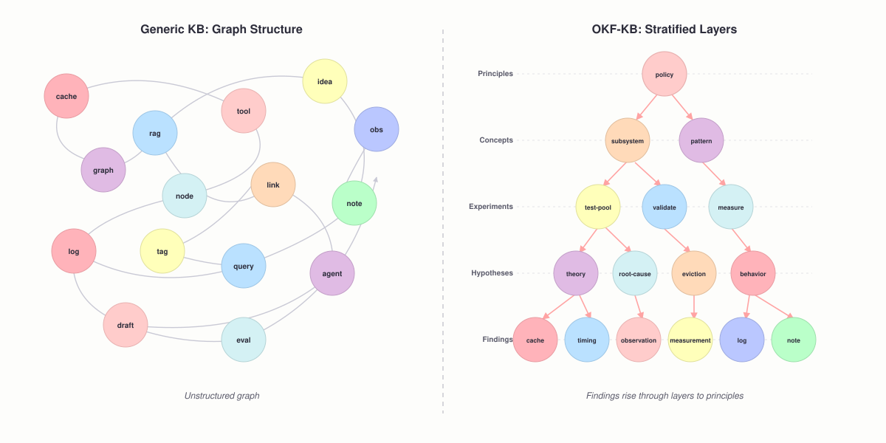

# okf-schema

[](https://github.com/gsemet/okf-schema/actions/workflows/ci.yml)
[](https://codecov.io/gh/gsemet/okf-schema)
[](https://pypi.org/project/okf-schema/)
[](https://pypi.org/project/okf-schema/)
[](https://github.com/astral-sh/ruff)
[](./)
[](https://opensource.org/licenses/MIT)
[](https://okf-schema.readthedocs.io/en/stable/)

**okf-schema** is a CLI tool and Python library for working with **OKF (Open Knowledge Format)** bundles
with JSONSchema validation of the frontmatter metadata, and formatting capabilities while preserving comments.

OKF is a markdown-based knowledge format where each concept is a markdown file with YAML frontmatter.
See the [OKF specification](https://github.com/GoogleCloudPlatform/knowledge-catalog/blob/main/okf/SPEC.md) for the full format definition.

📚 **Full documentation**: [okf-schema.readthedocs.io](https://okf-schema.readthedocs.io/en/stable/)

> [!IMPORTANT]
> OKF-schema is opinionated. Generic OKF requires a non-empty `type` but does
> not centrally register type values, and consumers should tolerate unknown
> types. When a schema database is present, OKF-schema validates registered
> types against their corresponding schemas. An unregistered type produces W6;
> strict validation treats that warning as a failure. Additional frontmatter
> properties are accepted or rejected according to the selected schema.

## Three layers: generic `okf-schema`, `okfkb`, and `okfreq`

The package has one generic foundation and two separate opinionated subsets:

| Layer | Scope | Command | What it provides |
|-------|-------|---------|------------------|
| **Generic `okf-schema`** | Any OKF bundle | `okf-schema` | Schema validation, frontmatter linting, indexing, links, bundle integrity, and the Python API. |
| **Knowledge base `okfkb`** | Engineering knowledge | `okfkb` or `okf-schema kb` | A stratified lifecycle for immutable Findings, hypotheses, experiments, concepts, structures, principles, playbooks, and outcomes. |
| **Requirements `okfreq`** | Stakeholder and software requirements | `okfreq` | Explicit requirement IDs, StRS/SwRS hierarchy, lifecycle, derivation, verification markers, coverage, and traceability. |

`okfkb` and `okfreq` are not aliases and should not be mixed in one bundle:
`okfkb` manages knowledge maturity, while `okfreq` manages requirements and
their implementation evidence. Both subsets reuse the generic `okf-schema`
mechanics underneath. A project can use only generic OKF, either subset, or
both in separate bundles.

## What `okf-schema` adds to OKF

Plain OKF defines a folder of markdown files. `okf-schema` turns those files into
a validated, searchable knowledge bundle by adding:

| Capability | What it does |
|-----------|--------------|
| **Schema-driven frontmatter validation** | Every concept's YAML frontmatter is checked against a JSONSchema. Invalid fields, missing required keys, or wrong types are reported as structured errors. |
| **Auto-discovered schemas** | Schemas live inside the bundle under `_schema/` (e.g. `_schema/concept.schema.yaml`). The `type` field in a concept's frontmatter tells `okf-schema` which schema file to load. A concept with `type: concept` is validated against `_schema/concept.schema.yaml`. Schemas can be written in **YAML**, **JSON**, or **JSON5** (JSON with comments and trailing commas). |
| **Bundle integrity checks** | Detects broken internal links, missing `index.md` files, malformed `log.md` entries, and reserved-file violations. |
| **Safe linting** | Normalizes YAML frontmatter by flattening nested lists and converting block-style to inline notation while preserving comments and custom quotes via `ruamel.yaml`. Also auto-updates `links` and `backlinks` fields from markdown body content. |
| **Analytics** | Bundle statistics. |

See a real schema definition in [`examples/ai-llm-knowledge-base/_schema/concept.schema.yaml`](examples/ai-llm-knowledge-base/_schema/concept.schema.yaml).

Example of structure

```raw
my-bundle/
├── _schema/
│   ├── concept.schema.yaml
│   ├── tool.schema.json
│   └── paper.schema.json5
├── concepts/
│   ├── rag.md
│   └── chain-of-thought.md
├── tools/
│   ├── langchain.md
│   └── llamaindex.md
├── papers/
│   ├── rag-paper.md
│   └── chain-of-thought-paper.md
├── index.md
└── log.md
```

The `type` field in each entity frontmatter determines which schema is used for validation.
For example, `type: concept` uses `_schema/concept.schema.yaml`, while `type: tool` uses `_schema/tool.schema.json`.

Schema extensions supported:

- `.schema.yaml` — YAML (human-friendly, supports comments and anchors)
- `.schema.json` — JSON (strict syntax, widely supported by editors)
- `.schema.json5` — JSON5 (JSON with comments, trailing commas, and unquoted keys)

For detailed information on `$ref` support and schema composition, see the [full documentation](https://okf-schema.readthedocs.io/en/stable/).

## Installation

Use UV to install this tool, or to use in your skill:

```bash
uv tool install okf-schema
```

This installs the `okf-schema`, `okfkb` (Knowledge base), and `okfreq` (Requirements) commands.

## Use Cases

The package serves **three distinct use cases**:

- **Use Case 1 — Generic OKF**: Build, maintain, and validate OKF bundles with JSON Schema.
- **Use Case 2 — `okfkb`**: Maintain an opinionated knowledge base for empirical findings, hypotheses, and concepts.
- **Use Case 3 — `okfreq`**: Manage and trace software requirements, linking them to implementation and test evidence.
- **Use Case 4 — Standalone Markdown**: Validate individual Markdown files against JSON Schemas without a full bundle.

`okfreq` and `okfkb` are separate subsets documented alongside the generic
workflow.

### Use Case 1: Build, Maintain & Validate OKF Bundles

Create and manage complete OKF bundles with folder structure, schemas, index files, and integrity checks.

**Quick Start:**

```bash
# Initialize a new OKF bundle
okf-schema init my-bundle

# Update index.md files for all directories
okf-schema index --path my-bundle/bundle

# Lint frontmatter (flatten nested lists, inline block-style, auto-update links/backlinks)
okf-schema lint --path my-bundle/bundle

# Validate bundle structure and frontmatter
okf-schema validate --path my-bundle/bundle --strict

# List all concepts
okf-schema list --path my-bundle/bundle

# Find backlinks to a concept
okf-schema backlinks --path my-bundle/bundle concepts/react-pattern
```

More information in the documentation: [OKF-Schema CLI](https://okf-schema.readthedocs.io/en/stable/reference/cli.html).

### Use Case 2: Knowledge-base subset (`okfkb`)

Record empirical findings, hypotheses, and concepts using a stratified knowledge model with structured types and validation.



**Quick Start:**

```bash
# Initialize a new KB bundle
okfkb init my-knowledge-base

# Record a finding
okfkb new-finding my-knowledge-base \
  --title "AI agents improve coding speed" \
  --confidence confirmed

# Navigate the KB (agent-native memory tools)
okfkb search "cache eviction" my-knowledge-base --tier findings
okfkb get findings/2026.07.04-14.30-... my-knowledge-base
okfkb read concepts my-knowledge-base
okfkb query "type:finding confidence:>=high tag:cache" my-knowledge-base
okfkb query "finding[tag=cache] -> concept -> principle" my-knowledge-base
```

**For full KB documentation**, see the [OKFKB CLI](https://okf-schema.readthedocs.io/en/stable/reference/kb-commands.html), [OKF-KB Design Choices](https://okf-schema.readthedocs.io/en/stable/explanation/okfkb-choices.html) and [HW Debugging Workflow Tutorial](https://okf-schema.readthedocs.io/en/stable/tutorials/okfkb-hw-debugging-workflow.html).

**Agent skills** complement the CLI: `okf-schema` handles tool mechanics,
`okfkb` teaches and routes the knowledge lifecycle, and `okfkb-gardening` runs
explicit, autonomous KB maintenance. See [Agent Skills](skills/README.md) and
[Maintain an OKFKB with agent skills](docs/source/how-to/maintain-okfkb-with-skills.md).

### Use Case 3: Requirements subset (`okfreq`)

`okfreq` is an independent, requirements-focused layer built on the same
generic OKF mechanics. It is intended for requirements repositories, not for
the `okfkb` knowledge tiers. It provides:

- separate StRS stakeholder and SwRS software-requirement layers;
- stable requirement IDs and explicit lifecycle states;
- authored `derives_from` relationships with generated reverse links;
- `@implements_req` and `@tests_req` markers for implementation and test
  traceability; and
- validation, coverage, graph, report, archive, and supersession commands.

Initialize and validate a requirements bundle with:

```bash
okfreq init my-requirements
okfreq new strs "Export report" \
  --description "When export is requested, the reporting capability SHALL make a portable report available." \
  --user-need "Users need a portable report for offline review." \
  --project demo
okfreq validate my-requirements
okfreq trace my-requirements
```

See the [`okfreq` requirements tutorial](https://okf-schema.readthedocs.io/en/stable/tutorials/okfreq-traceability.html),
the [`okfreq` design choices](https://okf-schema.readthedocs.io/en/stable/explanation/okfreq-choices.html),
and the [skill scope guide](skills/README.md) for the distinction between
generic OKF, `okfkb`, and `okfreq`.
See the complete [`okfreq` CLI reference](docs/source/reference/okfreq-cli.md)
for every command and option.

### Use Case 4: Validate Standalone Markdown Files

Validate individual markdown files (or collections) against JSON schemas without needing a full OKF bundle.

**Quick Start:**

```bash
# Validate all markdown files in a directory
okf-schema validate-md \
  --input 'docs/**/*.md' \
  --schemas-dir ./schemas

# Validate multiple patterns with strict mode
okf-schema validate-md \
  --input '*.md' \
  --input 'docs/**/*.md' \
  --schemas-dir ./schemas \
  --strict
```

**Key Commands:**

| Command | Purpose |
|---------|---------|
| `validate-md --input PATTERNS --schemas-dir DIR` | Validate standalone files against schemas |
| `--input 'pattern'` | Glob pattern for files (supports `**` for recursion); can be used multiple times |
| `--schemas-dir DIR` | Directory containing schema files (`<type>.schema.{json\|yaml\|json5}`) |
| `--strict` | Treat warnings as errors (exit 1) |

**For examples and troubleshooting**, see the [Standalone File Validation Guide](https://okf-schema.readthedocs.io/en/stable/how-to/validate-standalone-files.html) and [Validation Error & Warning Codes Reference](https://okf-schema.readthedocs.io/en/stable/reference/validation-codes.html).

### Validation Reference


## Recommended Workflow

Before packaging or distributing a bundle, run these three commands in order and fix all warnings:

```bash
okf-schema index --path my-bundle/bundle    # regenerate index.md files
okf-schema lint --path my-bundle/bundle     # flatten nested lists, inline block lists, update links/backlinks
okf-schema validate --path my-bundle/bundle --strict # check structure, schema, and links; fail on warnings
```

Only zip or ship the bundle once `validate --strict` reports **zero errors and zero warnings**. Warnings such as missing `index.md` (W4), block-style lists (W7), or broken cross-links (W2) signal issues that will degrade the experience for downstream consumers.

## Example: AI & LLM Knowledge Base

The [`examples/ai-llm-knowledge-base/`](examples/ai-llm-knowledge-base/) directory contains a realistic knowledge base with **three concept types** — `concept`, `tool`, and `paper` — each validated by its own schema in `_schema/`.

### How `type` selects the schema

The `type` field in a concept's frontmatter determines which schema file is loaded. A file with `type: concept` is validated against `_schema/concept.schema.yaml`; `type: tool` against `_schema/tool.schema.json`; and `type: paper` against `_schema/paper.schema.json5`.

### Schema format support

`okf-schema` accepts schemas in three formats:

| Extension | Format | Notes |
|-----------|--------|-------|
| `.schema.yaml` | YAML | Human-friendly, supports comments and anchors |
| `.schema.json` | JSON | Strict syntax, widely supported by editors |
| `.schema.json5` | JSON5 | JSON with comments, trailing commas, and unquoted keys |

### Schema highlights

**`concept.schema.yaml`** — AI concepts with enums, email validation, and kebab-case regex:

```yaml
properties:
  category:
    enum: [LLM, AI Agent, Coding Agent, Prompt Engineering, Tooling, Evaluation]
  maturity:
    enum: [experimental, beta, production, deprecated]
  author_email:
    type: string
    format: email
  tags:
    type: array
    items:
      pattern: "^[a-z0-9-]+$"   # kebab-case only
```

**`tool.schema.json`** — Developer tools with URI validation and language enums:

```json
{
  "properties": {
    "license": {
      "enum": ["MIT", "Apache-2.0", "GPL-3.0", "Proprietary", "Other"]
    },
    "language": {
      "enum": ["Python", "JavaScript", "TypeScript", "Rust", "Go", "Java", "Multi-language"]
    },
    "url": { "type": "string", "format": "uri" }
  }
}
```

**`paper.schema.json5`** — Research papers with year bounds and venue enums:

```javascript
// JSON5 allows comments, trailing commas, and unquoted keys
{
  properties: {
    year: { type: "integer", minimum: 1950, maximum: 2030 },
    venue: {
      enum: ["NeurIPS", "ICML", "ICLR", "ACL", "EMNLP", "arXiv", "Other"]
    },
    bibtex_key: { pattern: "^[A-Za-z0-9_-]+$" },
  },
}
```

### Schema-aware index generation

Schemas can declare `title`, `description`, and an `x-okf-summary` extension
field. When a subdirectory contains concepts of a single type,
`okf-schema index` uses them to produce richer `index.md` files:

| Field | Purpose | Used in |
|-------|---------|---------|
| `title` | Short heading for the concept type | Subdirectory `index.md` H1 |
| `x-okf-summary` | One-line description of the type | Root listing |
| `description` | Longer schema description | Subdirectory intro |

For example, `concept.schema.yaml` declares:

```yaml
title: "Concept"
x-okf-summary: "AI/LLM concepts such as techniques, patterns, or architectural ideas."
description: "Schema for AI/LLM concepts ..."
```

Running `okf-schema index` turns this into:

- A root `index.md` entry: `[concepts](./concepts/) — AI/LLM concepts such as...`
- A subdirectory `index.md` with `# Concept` as the heading and the description as
  the first paragraph.

### Concept file example (`concepts/rag.md`)

```markdown
---
type: concept
title: Retrieval-Augmented Generation
description: >
  A technique that enhances LLM outputs by retrieving relevant documents
  from an external knowledge store and injecting them into the prompt.
category: LLM
maturity: production
author_email: bob@example.com
complexity: intermediate
tags: [rag, retrieval, llm, knowledge-base]
related_tools: [LangChain, LlamaIndex, OpenAI-API]
---

# Retrieval-Augmented Generation

RAG combines parametric knowledge (the model's weights) with non-parametric
knowledge (external documents) to reduce hallucinations...
```

### Validation in action

```bash
# Validates all concepts, tools, and papers against their respective schemas
okf-schema validate --path examples/ai-llm-knowledge-base

# Show bundle statistics
okf-schema stats --path examples/ai-llm-knowledge-base
```

## Opinionated Knowledge Base

`okf-schema` includes a dedicated knowledge-base subcommand group (`okfkb`) for managing OKF
bundles designed for agent-facing experimental findings. A knowledge base is an
opinionated OKF bundle with 9 content directories (concepts, experiments,
findings, hypotheses, outcomes, playbooks, principles, reference, and structures)
and 10 YAML schemas including the shared base schema.

```bash
# Scaffold a new knowledge base in the current directory
okfkb init my-kb

# Install KB skills and guidelines into a project
okfkb install-skills /path/to/project

# Alternatively, use the okf-schema init --pattern flag
okf-schema init my-kb --pattern kb
```

The `okfkb` binary is a standalone alias for `okf-schema kb` — both are equivalent.

| Command | Description |
|---------|-------------|
| `okfkb init [PATH]` | Scaffold KB layout with 9 content dirs, 10 schemas, `index.md`, `log.md` |
| `okfkb install-skills [PATH]` | Deploy bundled skills and guideline into a project; patch `AGENTS.md` |
| `okfkb new-finding [PATH] --title TEXT` | Create a timestamped, schema-valid empirical Finding |
| `okfkb update [PATH]` | Regenerate indexes and lint frontmatter (index + lint in one step) |
| `okfkb validate [PATH]` | Validate bundle with strict mode (warnings as errors) |
| `okfkb search TEXT` | Ranked case-insensitive substring search across the KB (optionally scoped `--tier`) |
| `okfkb get ID` | Exact fetch of a single node by id or path |
| `okfkb read TIER` | Read a whole stable tier (e.g. `concepts`, `principles`) |
| `okfkb query EXPR` | Structured query: frontmatter filter DSL + graph traversal (see below) |
| `okf-schema init NAME --pattern kb` | Same scaffold as `okfkb init` via the pattern registry |

### Navigating the KB: `search` / `get` / `read` / `query`

Beyond authoring, `okfkb` exposes the KB as a small set of **navigation tools** so an agent
can actively pull the right granularity instead of loading whole folders:

- **`search`** — coarse ranked retrieval across titles, context, tags, and body.
- **`get`** — exact fetch of one node by id/path (the drill-down after a `search`).
- **`read`** — read an entire stable tier at once (top-down entry, e.g. `read principles`).
- **`query`** — structured selection combining two styles:
  - **Filter DSL** (flat frontmatter): `key:value` / `key:<operator>value`, ANDed. Confidence is
    ordinal, so ranges work:
    ```bash
    okfkb query "type:finding confidence:>=high tag:pll status:active"
    ```
  - **Arrow traversal** (a pocket-Cypher over links and derivation edges):
    `->` follows `links`, `<-` follows `backlinks`, and `^` follows computed
    `derives_to` edges:
    ```bash
    okfkb query "finding[tag=pll,confidence=high] ^ concept ^ principle"
    okfkb query "concept[title~boot] -> playbook"
    ```

**For full KB documentation and commands**, see the [OKF Knowledge Base reference](https://okf-schema.readthedocs.io/en/stable/reference/kb-commands.html).

## Python API

```python
from okf_schema.api import validate_bundle

report = validate_bundle("path/to/bundle")
for finding in [*report.errors, *report.warnings]:
    print(finding.code, finding.message, finding.path)

# The _schema/ directory inside the bundle is auto-discovered.
# You can also pass an explicit schema_db path:
# report = validate_bundle("path/to/bundle", schema_db="path/to/schemas")
```

## Agent Skills

The repository provides six complementary skills:

| Skill | Concise purpose |
|---|---|
| [`okf-schema`](skills/okf-schema/SKILL.md) | Operate and troubleshoot the CLI/API, schemas, validation, frontmatter, and generic OKF bundles. |
| [`okfkb`](skills/okfkb/SKILL.md) | Teach and route the opinionated lifecycle from immutable Findings to stable knowledge and human-governed Principles. |
| [`okfkb-record-findings`](skills/okfkb-record-findings/SKILL.md) | Capture one dated, immutable empirical Finding after an investigation. |
| [`okfkb-distill`](skills/okfkb-distill/SKILL.md) | Interactively reconcile contradictions and propose evidence-backed promotions. |
| [`okfkb-gardening`](skills/okfkb-gardening/SKILL.md) | Perform explicitly invoked, zero-prompt consolidation, graph repair, stale-knowledge review, and project-prescribed validation. |
| [`okfreq-gardening`](skills/okfreq-gardening/SKILL.md) | Maintain requirement traceability, generated coverage, lifecycle, and health reports without conflating requirements with OKFKB knowledge. |

See [`skills/README.md`](skills/README.md) for selection guidance and the
recommended maintenance rhythm.

## Contributing

See [CONTRIBUTING.md](https://github.com/gsemet/okf-schema/blob/main/CONTRIBUTING.md) for development setup and guidelines.

## Known Alternative

Here is some alternative OKF tooling that may interest you as well:

- [IWE](https://github.com/iwe-org/iwe): Full-featured, Rust-based OKF bundle manager. It does
  not provide schema validation, but provides querying, indexing, an MCP server, a VS Code extension, and more.

Tons of other resources just limit to apply OKF to LLM-Wiki
(ex: [okf-harness](https://github.com/pumblus/okf-harness) or
[openknowledge](https://github.com/openknowledge-sh/openknowledge)).

OKF-Schema is deliberately more opinionated, focused on frontmatter validation and preparing
the bundle for direct agentic consumption (I do not plan to build a MCP server, I prepare my agent
to read files directly). `okfkb` is even more opinionated, with a strict but ready-to-use
knowledge base structure and schema.

## License

MIT License — see [LICENSE](https://github.com/gsemet/okf-schema/blob/main/LICENSE) for details.
