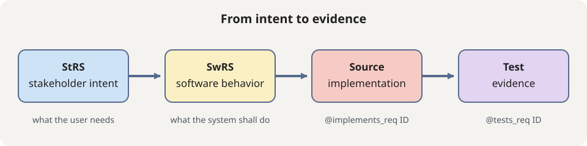
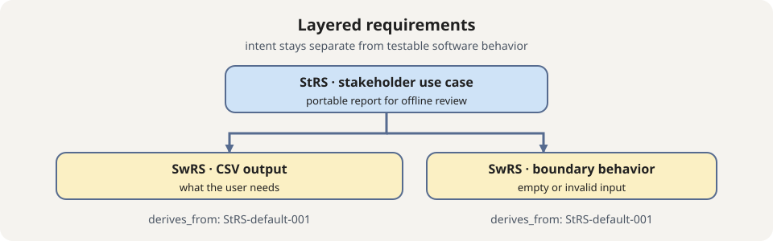

# Maintain 2-levels Code-anchored Requirements with `okfreq`

This tutorial is for developers, technical leads, product owners, testers, and
coding agents who need to keep their software project’s intent connected to
its implementation and tests.

It is an opinionated requirement storage structure based on OKF-Schema.
It serves two purposes:

- provide a ready-to-use, ISO29148 multi-layer, code-anchored requirements
  traceability, particularly adapted for open-source projects
- demonstrate and illustrate the base concepts so that more complex projects
  can adapt to their needs.

Remember OKREQ is already heavily customizable (you can override the default
schema), but it is directly based on OKF-Schema, so you can directly
rework the entiere workflow easily.

This tutorial explains both the ideas and the workflow.
If you only need commands, use the [build requirement base how-to](../how-to/okfreq-build-requirement-base.md).

## Minimal requirement structure

An `okfreq` requirements base has three organizing dimensions:

1. **Two requirement levels**: `StRS` captures the stakeholder outcome, while
    `SwRS` refines it into observable software behavior. A `SwRS` normally derives
    from one or more `StRS` requirements.
2. **A scope**: every requirement belongs to a configured group, such as a
    component, subsystem, or capability. For example, `Component` can be a
    scope used to separate one part of a project from another.
3. **A project**: the complete requirements base belongs to a project, product,
    or system. The project value is recorded in each requirement so documents
    remain identifiable when moved or exchanged.

A requirement is stored in a standalone Markdown file with YAML frontmatter
(1 requirement = 1 file). Links and relationships are expressed
in the frontmatter. The linter adds automatically backwards links
(`derived_by`) matching the authored `derives_from` links, allowing the
agents to navigate the hierarchy in both directions.

The filename makes these dimensions visible:

```text
<tier>-<project>-<scope>-<sequence>.md
```

For example:

```text
SwRS-OKFSCHEMA-OKFREQ-003.md
```

This means:

| Part | Example | Meaning |
|---|---|---|
| Tier | `SwRS` | Software requirement level. |
| Project | `OKFSCHEMA` | Project or system owning the requirement. |
| Scope | `OKFREQ` | Configured group or capability. |
| Sequence | `003` | Human-readable sequence within the configured ID policy. |

The same identity is repeated in frontmatter. The `id` is the stable readable
identifier used by filenames, derivation links, and source/test markers. The
`uuid` is a second, globally unique identity for the requirement. It remains
stable if the file is renamed or moved and helps resolve conflicts when two
branches or pull requests independently generate a requirement with the same
human-readable ID. A merge process can use the UUID, together with the authored
content and review history, to determine whether two documents are the same
requirement or conflicting requirements.

The project and scope are configured in `config.yml`; the `levels` entries map
the tier to its folder and ID prefix, and the `scopes` entries define the group
and the source/test directories that are scanned for traceability markers.

### Link to an external requirements system

The Markdown file can remain the local, traceable representation while pointing
back to a source system such as Jira, DOORS, or another requirements database.
Add the external fields to `tiers/_schema/base.schema.yaml`:

```yaml
    external_id:
        type: string
        minLength: 1
        description: Identifier in the external requirements system.
    external_url:
        type: string
        format: uri
        description: Link to the external requirement.
```

Then add them to the requirement frontmatter:

```yaml
external_id: REQ-4821
external_url: https://requirements.example.test/REQ-4821
```

Because these fields are declared in the base schema, both `StRS` and `SwRS`
documents may use them, and the linter checks that the ID is non-empty and the
URL is valid. Keep the local `id` and `uuid`: the external ID identifies the
record in the other system, while the local identities support repository
traceability and conflict resolution.

## What is a requirement?

A **requirement** is a small, agreed statement of behavior that the finished
system must provide or respect. It is written before implementation so that the
team can decide what to build and, later, whether the result is acceptable. A
set of requirements describes the behavior the system is expected to have; each
requirement describes one part of that behavior.

For a requirement to be useful, a developer and a tester should be able to
answer four questions:

1. **Who or what is concerned?** The system, a component, a user, or an external
    interface.
2. **What must happen?** The observable behavior or constraint.
3. **In which situation and with which limits?** The trigger, context, inputs,
    outputs, timing, error cases, or other relevant boundaries.
4. **How will we decide that it is satisfied?** The observation, review,
    measurement, or test that provides the acceptance evidence.

For example, “the service should be fast” is a wish, not a useful requirement.
“When asked to export 10,000 rows, the service shall return a report in under
two seconds on the CI benchmark machine” identifies the behavior, situation,
limit, and evidence needed to accept or reject it.

A requirement is therefore not an issue title, a design decision, a code
comment, or a task such as “implement CSV export”. Those may explain why work is
needed or how it might be done, but they do not define the behavior that must be
present in the finished system.

The goal of `okfreq` is to demonstrate how to keep production-level, structured
**living requirements specifications** that are:

- always up to date with the code
- tested
- with a traceability report and coverage score

It is **not** to give the ultimate source of truth.
These living requirements needs to be **compared** to the original
"intent requirements" and accepted, or adapted.

### What is a requirement specification?

A **Requirement Specification** is the document or structured set of documents
that collects requirements for a particular subject and level. The `RS` suffix
in names such as `StRS` and `SwRS` means “Requirement Specification”; it does
not mean that one requirement is a specification. A specification is the
organized agreement, while each requirement inside it is a small, testable
statement.

In a traditional V-cycle, a specification is written on the left side before
implementation. The team then implements the specified behavior and verifies it
on the right side. This does not mean that a requirement can never change. It
means that a change should be explicit: update the requirement, review its
impact, and update the implementation and evidence that depend on it.

AI Coding allows for the first time to be able to automatize or at least
heavily assist the requirements lifecycle and ground it more in the code
and tests. `okfreq` is designed to demonstrate how to apply the full traceability
as a modular component you can adapt freely in your workflow.

In practice, writing good requirement upfront is really hard, because it is not
grounded in a "truth" (like a code is compiled and tested).
At the end, developers and product owners often "discover" the requirement during implementation, get new ideas, pivot just after the implementation.

This is normal. **Humans do not know what they want until they see it.**

The Agile methodologies more or less embraced this reality: Writing perfect
requirements is impossible, what we can do is write
"intentions of requirements" and then adapt them as we go.

Let's see now how `okfreq` can help us to keep the requirements splited into
2 layers (ISO29148-like), grounded in the code with full traceability to code
and test.

## Requirements traceability

Traceability is the ability to follow a requirement through its lifecycle:

1. a **stakeholder** expresses a goal or use case;
2. the team **refines** it into implementable software behavior;
3. **source code** implements that behavior;
4. **tests** provide evidence that the behavior works; and
5. **reports** expose gaps, stale links, and change impact.

Without this chain, a passing test can be testing behavior nobody asked for, and
a requirement can remain unimplemented without anyone noticing.

In source code, a requirement is linked with an explicit marker:


The marker points directly to the corresponding `SwRS` Markdown document:


That document contains the expected software behavior in a form that can be
tested:


The software requirement derives from a higher-level stakeholder requirement,
which describes the user-facing goal:




`okfreq` demonstrate how to link the various layers of requirements together,
and how to link effectively and token-effectively the lowest requirement layer
to the code and tests.

## Why use two layers?

The initial `okfreq` hierarchy has two ISO 29148-like layers:

- **StRS** means Stakeholder Requirement Specification. It describes a user
    goal or use case in language the stakeholder can validate.
- **SwRS** means Software Requirements Specification. It describes behavior the
    software can implement and a test can observe.

Separating these layers prevents two common mistakes. First, a stakeholder goal
should not prescribe an implementation detail such as a database or algorithm.

Second, an implementation requirement should not be so vague that a tester
cannot decide what evidence is sufficient. One `StRS` can derive several
`SwRS` requirements when a single user outcome needs multiple behaviors.

The layers also make change impact explicit. If a user changes “export a report”
to “export a filtered report,” follow the `derives_from` link to the affected
`SwRS` requirements, then inspect every `@implements_req` and `@tests_req`
marker. Additional configured levels can be inserted later using the same
direction: authored `derives_from` links point upward, while generated
`derived_by` links point downward.



## How requirements are stored across tools

The main difference is the unit each tool stores: a feature, a capability, a
document, a record, or an atomic requirement.

| Project | Requirement storage | Code anchoring |
|---|---|---|
| [Kiro Specs](https://kiro.dev/docs/specs/feature-specs/) | One feature directory at `.kiro/specs/<feature>/`. Its `requirements.md` groups user stories and EARS acceptance criteria beside `design.md` and `tasks.md`. | Tasks provide the bridge to implementation; the format does not define persistent requirement markers in code. |
| [OpenSpec](https://github.com/Fission-AI/OpenSpec/blob/main/docs/overview.md) | Current requirements are grouped by capability in `openspec/specs/<capability>/spec.md`. Proposed additions and changes are stored separately under `openspec/changes/<change>/` and merged into the capability spec when archived. | Verification searches the repository for implementation evidence; the stored format does not require code-side markers. |
| [StrictDoc](https://strictdoc.readthedocs.io/en/stable/) | Each `.sdoc` file is a requirements document containing multiple nodes. Nodes can have stable UIDs, custom fields, and parent-child relations. | A requirement can reference a file, line range, or language item; source comments and docstrings can link back with `@relation(...)`. |
| [Tracey](https://github.com/bearcove/tracey) | Existing Markdown or StrictDoc files remain the source of truth. In Markdown, compact markers such as `r[channel.id.parity]` identify requirements inline. | Source and test markers use `r[impl ...]` and `r[verify ...]`. |
| [Mantra](https://github.com/mhatzl/mantra) | Requirements are structured records loaded from configured files. Each record has an ID and may declare parents or use dotted child IDs to form a hierarchy. | Rust annotations connect requirements to implementation and tests with `satisfies` and `verifies`. |
| **`okfreq`** (this project !!)| Each atomic requirement has its own Markdown file (named `<ID>.md`), with YAML frontmatter, stored under a configured tier and scope. Stable IDs, UUIDs, and `derives_from` links form the hierarchy. | `@implements_req <ID>` and `@tests_req <ID>` markers anchor each requirement to source and tests. |

Kiro and OpenSpec store requirements as part of a feature or capability spec.
StrictDoc stores several requirement nodes in a document, while Tracey adds
identifiers to existing documents and Mantra uses structured records.

`okfreq` treats every requirement as an independently versioned Markdown document,
but is very similar in behavior to Mantra + Tracey.

The main advantage of `okfreq` is that it is designed to be **AI-friendly**:
Agent knows markdown + yaml frontmatter, the jsonschema is directly exposed
to the agent without complex tooling (ex: LSP), and the CLI gives direct and
accurate feedbacks so the agent fixes automatically any issue.
Navigating the requirements files is direct by identifying a file named `<ID>.md`.

## Set up `okfreq`

From the root of a project where `okf-schema` is installed, initialize the
bundle:

```console
okfreq init .
```

This creates:

```text
.agents/requirements/
├── config.yml
├── guidelines/requirements.guidelines.md
└── tiers/
    ├── _schema/base.schema.yaml
    ├── _schema/strs.schema.yaml
    ├── _schema/swrs.schema.yaml
    ├── index.md
    ├── log.md
    ├── strs/
    └── swrs/
```

The bundle is split on purpose. `config.yml`, the installed agent guideline, and
generated reports are project control surfaces at the bundle root, while
`tiers/` holds the requirement documents and their schema. Keeping them apart
means a report or guideline edit can never be mistaken for a requirement change,
and the whole document layer can be scanned without filtering.

The bundle is independent from `okfkb`. Requirements are OKF-compatible Markdown
documents, but they have their own source of truth and lifecycle. Open
`config.yml` before creating documents. It defines levels, folders, ID prefixes,
lifecycle values, marker keywords, generated fields, and scope-specific source
and test directories.

Run this in CI as a required validation job:

```console
okfreq validate . --prose
okfreq lint . --prose
```

`validate` and `lint` are read-only. They should run alongside the normal project
test suite; a traceability marker does not prove that a test passes.

### Read the requirements reports

Generate the detailed JSON report and the human-readable Markdown summary with:

```console
okfreq generate-report . \
    --output-json dist/requirements-report.json \
    --output-summary-md dist/requirements-report.md
```

The JSON report is the machine-readable source for future dashboards. It includes
the complete requirement text and frontmatter, requirement paths, scopes and
hierarchy, linked implementation and test files, diagnostics, and aggregate
statistics. The Markdown file is intentionally smaller: it summarizes totals,
per-scope coverage, and key status values for each requirement.

The initial report has three separate linkage metrics:

- **Source coverage**: requirements with at least one `@implements_req` marker.
- **Test-link coverage**: requirements with at least one `@tests_req` marker.
- **Combined traceability**: requirements with both kinds of marker.

Only configured leaf requirements without annotation exemptions are included in
these percentages. A linked test is counted as covered when its marker is
present, but this does not show that the test ran or passed. Until test-result
input is supported, execution is explicitly reported as `not_collected`.

```{admonition} Linkage is not test success
:class: warning

`okfreq` currently parses requirement markers and file paths only. It does not
parse pytest, JUnit, coverage.py, or other test-runner results. The report can
show that a test file is linked to a requirement, but not that the test ran or
passed. A real requirement-coverage measure would require successful validation
tests whose results are associated with the corresponding requirements.
```

The project workflow writes `dist/requirements-report.json`,
`dist/requirements-report.schema.json`, and `dist/requirements-report.md` after
the test suite, and CI uploads them as downloadable artifacts. Missing
links are reported as findings but do not currently fail preflight; structural
or operational errors still do.

Future versions can add test-result adapters and populate execution statuses such
as passed, failed, skipped, or blocked without changing the meaning of the
initial linkage metrics.

### Add custom frontmatter fields

Requirement frontmatter can carry project-specific metadata such as an owner,
safety classification, review board, or external reference. Declare the field
in the schema that owns its meaning before adding it to a requirement. Schema
files may be written as YAML (`.schema.yaml` or `.schema.yml`), JSON
(`.schema.json`), or JSON5 (`.schema.json5`). The filename stem is matched to
the requirement type without regard to case: `type: StRS` selects
`strs.schema.yaml`, and `type: SwRS` selects `swrs.schema.yaml`.

- Add fields shared by every requirement to `tiers/_schema/base.schema.yaml`.
- Add StRS-only fields to `tiers/_schema/strs.schema.yaml`.
- Add SwRS-only fields to `tiers/_schema/swrs.schema.yaml`.

For example, to record the responsible team on every requirement, add this
property to the `properties` mapping in `base.schema.yaml`:

```yaml
    owner:
        type: string
        minLength: 1
        description: Team responsible for maintaining the requirement.
```

Then add the field to a requirement's frontmatter:

```yaml
owner: reporting-team
```

If the field is meaningful only for software requirements, put the same
property in the `properties` mapping of `swrs.schema.yaml` instead. Do not put
SwRS coverage fields such as `implemented_in_files` or `tested_in_files` on an
StRS; those fields are generated for leaf software requirements.

The schema is not just documentation: `okfreq validate` and `okfreq lint` load
the matching schema and enforce its types, required fields, constants, and
constraints. The shared `base.schema.yaml` may be extended with `$ref` from the
tier schemas, as in the generated bundle. The requirements validator resolves
those local references before validating the frontmatter.

```{admonition} Allowing additional fields
:class: warning

If a schema should accept project-specific fields that are not listed in its
`properties`, set `additionalProperties: true` on that schema (or on the
shared base schema). If you set `additionalProperties: false`, every custom
frontmatter field must be declared explicitly in the appropriate schema or the
linter will reject the requirement. Keep this choice deliberate: allowing
extra fields preserves producer metadata, but declaring fields gives them
documented types and constraints.
```

After changing a schema, validate the complete bundle and review the result:

```console
okfreq validate . --prose
okfreq lint . --prose
okfreq update-coverage . --check
```

The base and tier schemas currently allow additional properties so existing
producer metadata remains interoperable. Declaring a custom field explicitly
is still recommended: it documents the field, validates its type and
constraints, and makes the intended ownership visible to other contributors.

## Create requirements safely

Create the stakeholder statement first:

```console
okfreq new strs "Export report" \
    --description "When report export is requested, the reporting capability SHALL make a portable report available." \
    --user-need "Users need a portable report for offline review." \
    --project demo
```

This creates a draft requirement such as `StRS-default-001`, with a generated
UUID and no invented coverage. Its Markdown body separates normative behavior,
the preserved user need, and stakeholder rationale/constraints. Then derive
software behavior from it:

```console
okfreq new swrs "Write CSV" \
    --description "When export is requested, the service SHALL write selected rows as UTF-8 CSV." \
    --project demo \
    --derives-from StRS-default-001
```

Native `SwRS` creation requires one or more `StRS` IDs. Do not put source code,
test claims, or generated reverse links into the stakeholder statement. Keep
authored `derives_from`, `depends_on`, verification information, lifecycle, and
unknown producer metadata intact when editing.

The generated templates are intentionally different. Complete an StRS by
filling its stakeholder need and constraints; it has no software scenarios or
verification-notes section. Complete an SwRS by replacing both generated
GIVEN-WHEN-THEN scenario placeholders and its objective verification notes; it
has no stakeholder `User Need` or rationale/constraints section. Any remaining
angle-bracket placeholder is an explicit authoring gap.

## Work with a coding agent

Give the agent a requirement ID and an explicit scope. A useful request is:

> Implement `SwRS-default-001` in the existing export module. Add focused unit
> tests for successful CSV output, empty input, and invalid rows. Put
> `@implements_req SwRS-default-001` on the implementation and
> `@tests_req SwRS-default-001` once in each relevant test file. Run the project tests,
> then run `okfreq trace` and `okfreq validate`. Do not change the requirement’s
> lifecycle or remove existing metadata.

Ask the agent to add tests in the same request as the implementation. Also ask
it to show the files it marked and the test command it ran. This keeps the
marker relationship reviewable rather than treating a generated coverage field
as proof.

### Python example

```python
# @implements_req SwRS-default-001
def export_rows(rows: list[list[str]]) -> str:
        return "\n".join(",".join(row) for row in rows)
```

```python
# @tests_req SwRS-default-001
def test_export_rows() -> None:
        assert export_rows([["a", "b"]]) == "a,b"
```

### Rust example

The marker is a comment, so the same convention works in Rust:

```rust
// @implements_req SwRS-default-001
fn export_rows(rows: &[Vec<&str>]) -> String {
        rows.iter().map(|row| row.join(",")).collect::<Vec<_>>().join("\n")
}
```

```rust
// @tests_req SwRS-default-001
#[test]
fn exports_selected_rows() {
        assert_eq!(export_rows(&vec![vec!["a", "b"]]), "a,b");
}
```

Source markers answer “where is this behavior implemented?” Test markers answer
“where is it checked?” Both matter. Source-only coverage identifies behavior
that may have no regression protection. Test-only coverage may identify a test
that no longer exercises the production behavior. Markers do not replace code
review, static analysis, or the test runner.

## Inspect and compute traceability

Use `index` for a stable list of requirement IDs, `in-file` to inspect one
document, and `scope` to see the directories that will be scanned:

```console
okfreq index .
okfreq in-file .agents/requirements/tiers/swrs/SwRS-default-001.md
okfreq scope .
okfreq trace . --json
```

`trace` distinguishes implementation markers, test markers, unknown IDs, and
scan warnings. Marker keywords are configurable, so projects do not need to
use a hard-coded `SwRS-` prefix. Non-leaf markers should normally produce a
warning: implementation and test evidence belongs on a leaf software behavior,
not only on the stakeholder goal.

`graph` displays authored `derives_from` relationships and computed reverse
`derived_by` links. The authored direction remains authoritative:

```console
okfreq graph . --json
```

`update-coverage` explicitly computes `implemented_in_files` and
`tested_in_files`. Preview first:

```console
okfreq update-coverage . --check
okfreq update-coverage . --diff
okfreq update-coverage .
```

The update is atomic and owns only generated fields. Comments, quotes, unknown
frontmatter, IDs, UUIDs, and Markdown bodies must survive. Indexes and reports
are also generated data and should not be hand-edited.

## Lifecycle and reports

New requirements begin as `draft`. The supported values are `draft`, `proposed`,
`approved`, `deprecated`, and `superseded`. Approval should only happen when
the configured verification information and structural checks are complete;
creating or formatting a document never changes lifecycle implicitly.

Lifecycle commands are explicit and never delete content:

```console
okfreq archive StRS-default-001 --yes
okfreq supersede SwRS-default-001 SwRS-default-002 --yes
```

Use `status` for a concise lifecycle and health summary. Use
`generate-report` for separate schema-health, structural-traceability,
marker-coverage, and lifecycle metrics:

```console
okfreq status .
okfreq generate-report . --output dist/requirements-report.json
okfreq generate-report . --output dist/requirements-report.md --format markdown
```

Reports are inspection artifacts. They include deterministic generator and
source provenance, and separate structural health, marker gaps, exemptions,
and lifecycle counts. Regenerate them rather than editing by hand; do not
collapse their metrics into one misleading score.

## Frontmatter and extension

The [okfreq frontmatter reference](../reference/okfreq-frontmatter.md) lists
every supported field, whether it is authored or generated, and how it is used.
The common required fields are `type`, `id`, `uuid`, `title`, `description`,
`project`, `scope`, `lifecycle`, `origin`, and `tier`.

To add project-specific information, add an unknown frontmatter property such as
`safety_goal`, `owner`, or `review_board`. The schema permits unknown properties
and `okfreq` preserves them. To add a new hierarchy level, add its folder,
prefix, and parent levels under `levels` in `config.yml`; use generic
`derives_from` links. To customize scanning, add a scope with `source_dirs` and
`test_dirs`. To customize syntax, change the marker keywords and ID pattern.

Do not repurpose generated fields as authored data. If another tool populates
coverage or producer metadata, leave it intact and document ownership in the
configuration. If configuration needs migration or merge, perform it as an
explicit operation and review conflicts instead of overwriting the file.

For the command-oriented setup path, see the [how-to guide](../how-to/okfreq-build-requirement-base.md).
For the design rationale, see [Why `okfreq` is separate](../explanation/okfreq-choices.md).

For an agent-led audit of an existing requirements base, use the
`okfreq-gardening` skill from the repository's `skills/okfreq-gardening/SKILL.md`
package. It checks
hierarchy, source/test markers, generated coverage, lifecycle state, and
configuration drift without replacing authored requirement content.
